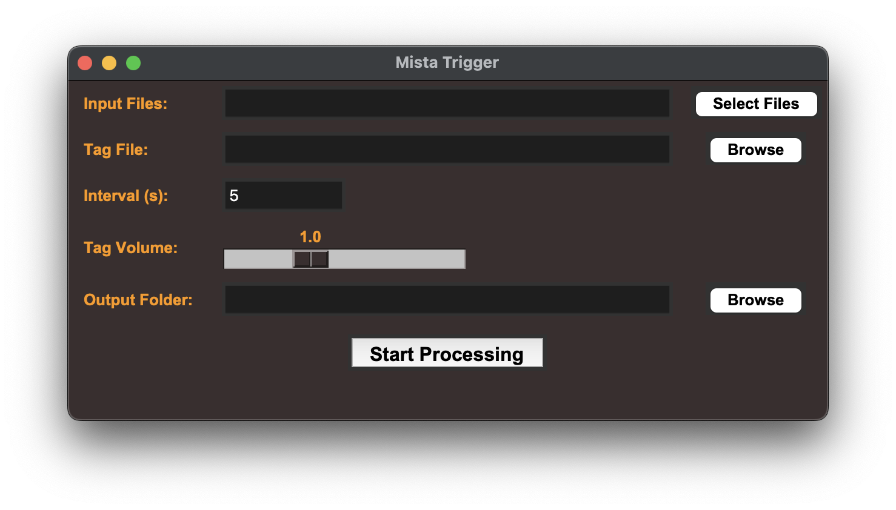

# mistaTrigger

A macOS Python GUI app for adding a repeated producer tag to songs.

## Functionalities

- Select one (or many) wav files for the inputFiles Field
- Select the tag to apply (.wav)
- Customize the interval and volume of the tag
  - the time between tags is calculated from the start of the tag
  - The volume feature could be better (but is good enough :P)
- select the output folder
- Press Start Processing, and done!

## Build

To build the app for macOS run:

source bin/activate
python setup.py py2app
